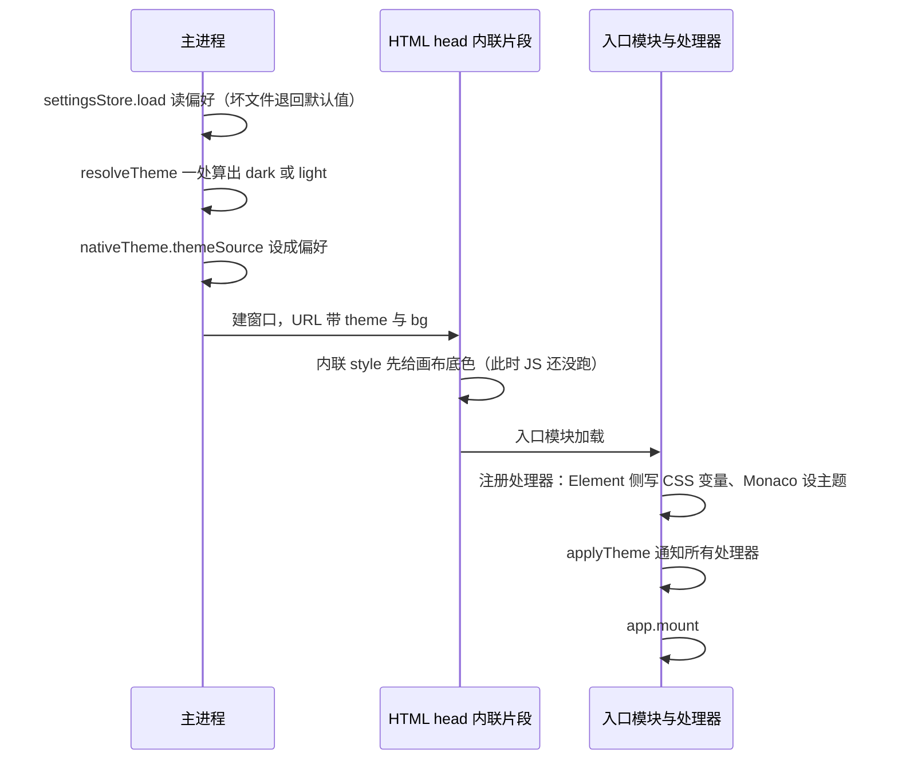
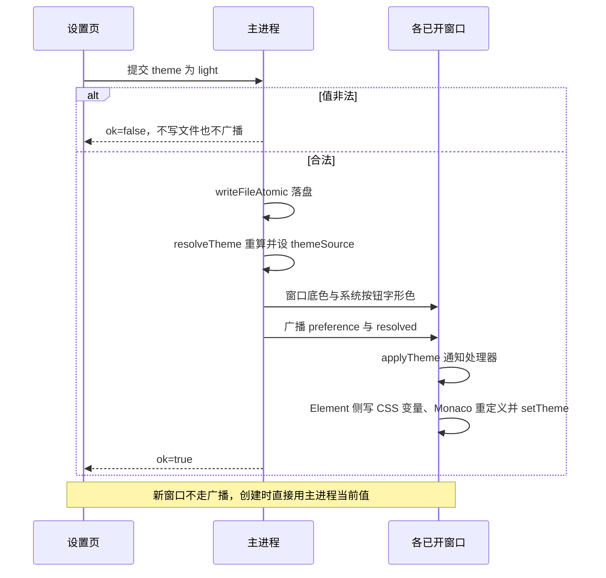

# 颜色主题切换

**状态**：待实施（**收编部分已落地**，见 §4 末尾；切换与设置页未做）
**关联**：[settings-page.md](./settings-page.md)（主题的偏好存在它的 `settings.yml`）

---

## 1. 背景

1. **只有深色一套。** 组件里的字面色值已收进令牌，但值全集中在 `src/renderer/styles/theme.css`：65 个 `--app-*` 令牌 + 要覆盖的 `--el-*` 色阶，共 **122 条颜色声明**，只有这一套。
2. **主进程那份是第二份真源。** `src/main/window-manager.ts` 的 `WINDOW_COLORS` 逐项与 `theme.css` 同值、靠注释维持一致——主题化要消灭的正是它。
3. **首帧颜色由主进程带进渲染进程。** `src/renderer/entries/shell/first-paint.ts` 的内联片段按窗口 URL 上的 `?bg=` 设 `--win-bg`。主题不能在挂载后才决定，否则先闪一下错误底色。
4. **窗口那一层也归主进程。** `BrowserWindow` 的 `backgroundColor` 与 Windows / Linux 的 `titleBarOverlay.symbolColor` 在 `create()` 里给，渲染进程改不了。
5. **四个入口各有独立样式。** 查看器与浮窗不引 Element Plus（各只加载 10 KB 主题样式），主题必须在每个入口都生效。
6. **尺寸也没有系统。** `theme.css` 之外还有 **363 个尺寸字面量**（`height` 74、`padding` 71、`font-size` 56、`width` 53、`gap` 30、`border-radius` 23）。

### 1.1 修改历史

| 日期 | 变更 | 原因 |
|---|---|---|
| 2026-09-29 | 首次记录（需求登记） | 使用者提出 |
| 2026-10-05 | 收编落地：值搬进 `src/common/theme.ts`、主题管理器与注册处理器、删掉主进程的 `WINDOW_COLORS` 镜像、补尺寸阶梯、加样式表扫描用例 | 先把不依赖设置页与切换的部分做完 |
| 2026-10-05 | 评审：定为**一份主题对象 + 一组注册的处理器**——值放 `src/common/theme.ts`（两个进程都 import），Element 侧的处理器把它写成 CSS 变量、Monaco 的处理器设自己的主题（含语法着色）；主进程只当"选择"的真源并管窗口那一层 | 对照 dsh 的 `ui-theme`、并纠正"值只放 CSS"会逼 JS 消费者去 DOM 里刮字符串 |

---

## 2. 目标与非目标

**目标**

1. 深色 / 浅色 / 跟随系统三种选择（偏好存哪见 §3.12）。
2. 切换后所有已开窗口（含查看器、浮窗、对话框）一起换，不重启、不闪错色。
3. **颜色与尺寸只有一个来源**：一份主题对象；组件里只写 `var(--app-*)`，CSS 里不许出现色值——由用例拦。
4. 加一套主题 = 在对象里加一份同形状的数据，不动组件、不动处理器。

**非目标**

- 不做任意自定义配色（选主色、自建主题）；
- 不做界面上的切换入口与持久化——那是 [settings-page.md](./settings-page.md)；
- 不做主题的导入导出与第三方注册。

## 3. 设计

### 3.1 数据形状

**(a) 主题定义**：`src/common/theme.ts`，一套主题一个条目，**键完全一致**——加主题就是照抄一份改值。

    THEMES.dark = {
      tokens: {                       // 既含颜色也含尺寸，键就是 CSS 变量名
        '--app-bg-page': '#1e1f22', '--app-text-regular': '#d8dadd', …
        '--app-space-2': '8px', '--app-radius-md': '4px', '--app-title-bar-height': '40px', …
      },
      monaco: {
        base: 'vs-dark',              // token 着色的底：第一版继承 base
        rules: [],                    // 语法规则（关键字/字符串/注释…），浅色落地时按需填
        colors: { 'editor.background': …, 行号、选中、当前行、差异色 },
      },
    }

**(b) 偏好**（`settings.yml` 的键，settings-page 负责读写；本项只消费）

    theme: dark          # dark | light | system，缺省 dark

**(c) 传递的是什么**：两个进程都 import 同一份对象，所以跨进程只传**选择**，不传值——

    { preference: 'dark' | 'light' | 'system',   // 来源：settings.yml
      resolved:   'dark' | 'light' }             // 主进程解析后的结果；处理器拿 THEMES[resolved]

**关键约定：`resolved` 只由主进程算一次**（`preference === 'system' ? (nativeTheme.shouldUseDarkColors ? 'dark' : 'light') : preference`）。窗口底色与界面都用它，避免"窗口深色、界面浅色"这种两处各算一次的错位。

### 3.2 启动流程

**为什么画布底色要单独提前**：外链 CSS 与模块脚本都晚于首次绘制，而"值的唯一来源是对象"这件事在 JS 跑起来之前无法兑现——所以主进程把**一个底色**经 URL 内联过去。这是唯一一处提前，不是第二份调色板。

### 3.3 切换流程

界面侧不做乐观更新，`ok: false` 时提示并保持原样，避免"界面换了、窗口没换"。

### 3.4 主题管理器

`src/renderer/entries/shell/theme.ts`，四个入口共用；它同时是 `settings:changed` 的订阅点。

    applyTheme(theme)        记下当前主题，再依次调用所有 handler（传的是主题对象）
    onThemeChange(handler)   返回注销函数（组件在 onBeforeUnmount 里调）

三条约束：

- **handler 之间互不依赖，所以不需要约定顺序**：Monaco 从对象里取值，不从 DOM 里读——这正是把值从 CSS 挪进对象换来的。
- **注销要真的调**：编辑器页会挂载 / 卸载，不注销就会在切换时调用已卸载组件的 handler。
- **处理器只做"把新值落到自己这边"**：写 CSS 变量、设编辑器主题；不在这里做业务判断。

### 3.5 处理器清单

| 注册者 | 收到通知后做什么 |
|---|---|
| 应用本体（Element Plus 与页面，含尺寸） | **不是单独注册的**：管理器 `applyTheme()` 自己就把 `theme.tokens` 逐项写进 `:root`，再通知其余处理器——组件库的颜色全走 CSS 变量，变量一改它就跟着变 |
| Monaco（`monaco-env.ts`） | `defineTheme('plmanager', theme.monaco)` + `setTheme('plmanager')`，**含语法着色**（`rules`）与编辑器配色 |

**Element Plus 本身没有"主题 API"**：它的颜色全走 CSS 变量，所以"注册一个处理器"在这里的含义就是"把变量写对"——写完之后组件与页面一起变。不注册任何东西给组件库，注册的是**应用这一侧**的写变量动作。

### 3.6 主进程这一层

- 它 import 同一份对象：窗口底色与系统按钮字形色取 `THEMES[resolved].tokens[...]`，`WINDOW_COLORS` 与两态表一起删掉。
- **原生按钮分两种**：Windows / Linux 的 WCO 是显式的——`setTitleBarOverlay({ color, symbolColor })` 逐个窗口调；**macOS 的红绿灯不能逐个设色**，它跟随 `NSAppearance`，由 `nativeTheme.themeSource` 决定。
- 它还不只是为红绿灯：`themeSource` 同时决定渲染进程里 `prefers-color-scheme` 的结果——不设的话，走媒体查询的样式会跟系统而不是跟应用。
- **不要设成 `resolved`**：偏好是 `system` 时会把它钉死成当时的取值、不再跟随系统。规则是 `themeSource` = 偏好，`resolved` 由 `shouldUseDarkColors` 派生；`system` 时 `themeSource` 保持 `'system'`。

### 3.7 尺寸

- 进同一份 `tokens`（键 `--app-space-*` / `--app-radius-*` / 字号 / 控件高 / 结构尺寸），与颜色同一个处理器写下去——所以"统一"贯彻到底。
- **口径**：只有"同一条尺度轴上还能再取值"的才建令牌——重复出现或跨组件共享的（`12px` 49 处、`8px` 34 处、`4px` 32 处、`16px` 32 处）；一次性的对齐值（`1px` 边框、`2px` 偏移、某个卡片自己的宽）留字面量。

### 3.8 失败与边界

| 情形 | 行为 |
|---|---|
| `settings.yml` 坏 / 缺 `theme` / 值非法 | 退回 `dark` + 一条 error 日志；启动不受影响 |
| 窗口 URL 上的 `theme` 丢了 | 内联片段不设底色；入口按 `dark` 兜底并记一条 warn |
| 某套主题少一个键 | 类型上就是编译错误（`THEMES` 用 `as const`，其余主题按第一套的键类型约束），不留到运行时 |
| 处理器抛异常 | 逐个 try/catch 并记日志，一个处理器失败不影响其余与启动 |
| 写文件失败 | 返回 `ok: false`，不广播、不改窗口 |

### 3.9 强制：样式表扫描用例

- 扫 `src/renderer/**/*.{vue,css}` 的样式块：颜色只准以 `var(--app-*)` / `var(--el-*)` 出现（`#hex`、`rgb()` 一律失败），例外只有 `first-paint` 的内联片段那两处。
- **色值的唯一合法落点是 `src/common/theme.ts`**——这条也由用例守：全仓搜 `#hex` / `rgb(`，命中只允许出现在 `theme.ts`、`first-paint.ts`（都有注释说明）。
- dsh 用的是同一套机制（样式表扫描 + 例外清单）。

### 3.10 与 settings-page 的边界

- 偏好属于 `settings.yml`；通道复用它的 `settings:get` / `settings:set` / `settings:changed`，本项**不新增通道**，只是载荷里多带一个 `resolved`。
- 本项交付"值只有一处、换一套只差一次 `applyTheme`"；界面入口、持久化、校验与生效时机由 settings-page 落地。两者可分开实施。

### 3.11 关于「唯一真源」与渲染进程缓存

「唯一来源」分两层，两层都是单一的，但**来源不同**：

| 层 | 唯一真源 | 各窗口怎么一致 |
|---|---|---|
| **选择**（dark / light / system） | 主进程（`settings.yml` → 内存 → `resolved`） | 在一个窗口里改 → 回主进程 → 写文件 + **广播给所有窗口**；新窗口由 URL 带上当前值 |
| **值**（颜色与尺寸） | `src/common/theme.ts`（一份对象） | 两个进程 import 同一份；各窗口的同名处理器拿到同一个对象 |

**不在渲染进程放缓存（localStorage 之类）**：

1. 值的送达不是异步的——主进程建窗口时就把 `resolved` 写进 URL，渲染进程在**首帧之前**就有值；缓存只会补一个并不存在的延迟。
2. 缓存是第二份可过期的状态：手改 `settings.yml`、版本回滚、缓存与文件不同步时，会出现"新窗口先亮旧主题、等推送才纠正"。
3. 渲染进程侧持久化与"唯一来源"直接冲突；`file://` 下 localStorage 也不适合当权威值。

什么时候才值得加：当值的送达真的变成异步（例如以后改成"窗口先建、随后 IPC 推"）时，才需要缓存填那一帧。

## 4. 改动清单

| 位置 | 改动 |
|---|---|
| **新增** `src/common/theme.ts` | 主题对象：`tokens`（颜色 + 尺寸）与 `monaco`；其余主题按第一套的键约束 |
| `src/renderer/styles/theme.css` | 去掉全部值，只留 `var(--app-*)` 用法与 `--el-*` 映射 |
| **新增** `src/renderer/entries/shell/theme.ts` | 主题管理器：`applyTheme` 通知处理器、`onThemeChange` 注册与注销 |
| **新增** 写 CSS 变量的处理器 | 把 `theme.tokens` 逐项 setProperty；四个入口共用 |
| `src/renderer/entries/shell/first-paint.ts` | 按 `?bg=` 给画布底色（保留写死的兜底与注释） |
| `src/main/window-manager.ts` | 删 `WINDOW_COLORS`，改读 `THEMES[resolved].tokens`；`getWindowUrl()` 带 `theme`；设 `nativeTheme.themeSource`；`nativeTheme.on('updated')` |
| `src/main/settings/*`（settings-page） | `theme` 键、校验、原子写、广播载荷带 `resolved` |
| `src/renderer/views/main/scripts/monaco-env.ts` | 注册处理器：`defineTheme('plmanager', theme.monaco)` + `setTheme`；`CHANGE_COLORS` 同源 |
| 各 `.vue` | 363 个尺寸字面量里重复的那些换成令牌 |
| `docs/design/`（落地后） | 主题对象的口径、处理器清单、首帧例外 |

**已落地**（在 `feature/color-theme` 上，尚未并入 develop）：

| 提交 | 内容 |
|---|---|
| `a577344` | 颜色收编：122 条颜色声明搬进 `common/theme.ts`；管理器与四个入口的挂载；删掉主进程镜像；Monaco 改注册处理器；样式表扫描用例 |
| `8f0039d` | 修掉清理 `theme.css` 时留下的悬空注释续行（构建失败的真凶） |
| `9d9a8c0` | 尺寸收编：尺度阶梯 + 25 个文件里重复的间距 / 字号 / 圆角换成令牌 |
| `77f1b51` | Monaco 主题 id 收敛成常量（组件里还在传旧 id，导致编辑器回落成浅色默认主题） |

**剩余**：Monaco 的 `rules`（语法着色）按需填、浅色那套、切换与设置页——都不做则本项不算完成，文件继续留在 `docs/roadmap/`。

## 5. 风险

| 风险 | 应对 |
|---|---|
| 首帧闪错色 | 画布底色由主进程经 URL 提前给（§3.2） |
| `resolved` 两处各算一次，窗口与界面不一致 | 只由主进程算，载荷带过去（§3.1） |
| 某个处理器忘了注册或忘了注销 | 处理器清单固定（§3.5）；管理器逐个 try/catch；注销在 `onBeforeUnmount` |
| 一套主题少键、两份主题键不一致 | `as const` + 按第一套的键做类型约束，编译期就报 |
| 一次性的对齐值被塞进令牌，令牌表膨胀 | §3.7 的口径 |
| 浅色下对比度不足 | 另给一套（含系统按钮字形色与 Monaco 语法规则），逐窗口人眼走一遍 |

## 6. 验证方法

1. 静态：样式表扫描用例（颜色只走 token）；全仓搜 `#hex` / `rgb(` 只允许 `theme.ts` 与 `first-paint.ts`。
2. 纯逻辑：`resolveTheme`（三种偏好 × 两种系统态）、管理器的注册／注销与"一个处理器抛异常不影响其余"——都不需要 Electron。
3. 人工：深色下四个窗口各看一遍；浅色落地后同样；Windows / Linux 看系统按钮字形色；开两个窗口切一次，确认都跟上、没有闪。
4. 切换与持久化随 settings-page 落地时一并验（含"手改文件后重启"）。

## 7. 待决事项

| # | 事项 | 倾向 |
|---|---|---|
| 1 | 浅色那套的内容 | Element Plus 默认 + 我们的品牌主色，不自己维护整套变量 |
| 2 | Monaco 的语法 `rules` 何时填 | 第一版留空、由 `base` 继承；浅色落地时只填与界面冲突的几条 |
| 3 | 尺寸阶梯先收几档 | 只收重复 ≥ 3 次的值 |
| 4 | 样式表扫描放哪一层 | 渲染进程用例（`test/renderer/`），与只跑静态检查的那几项分开 |
